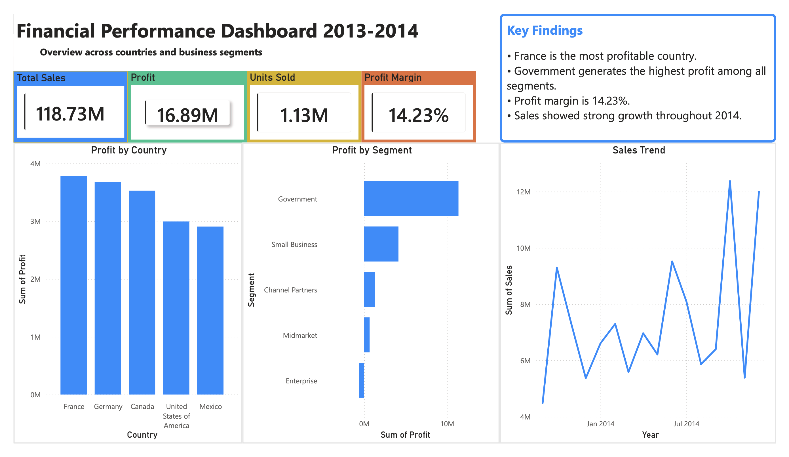
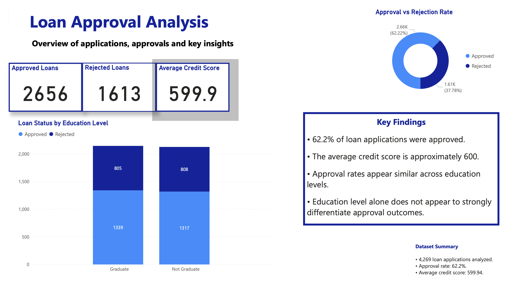
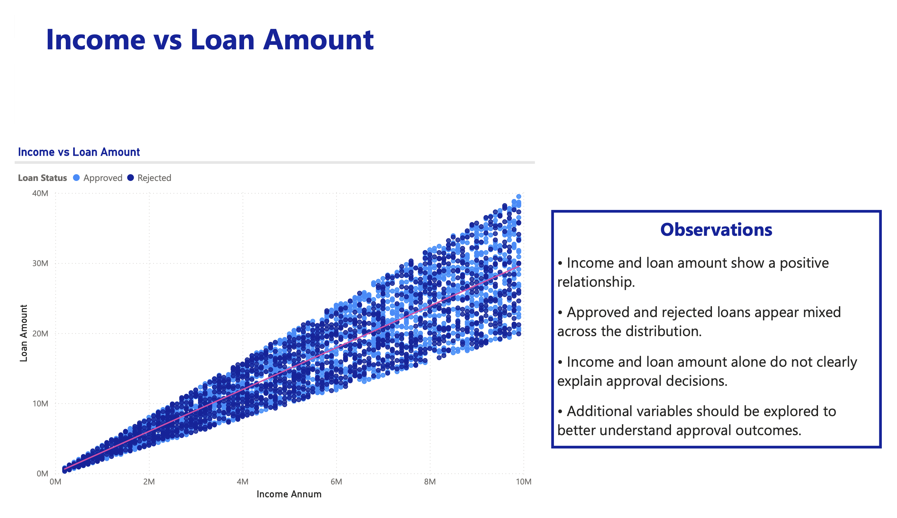
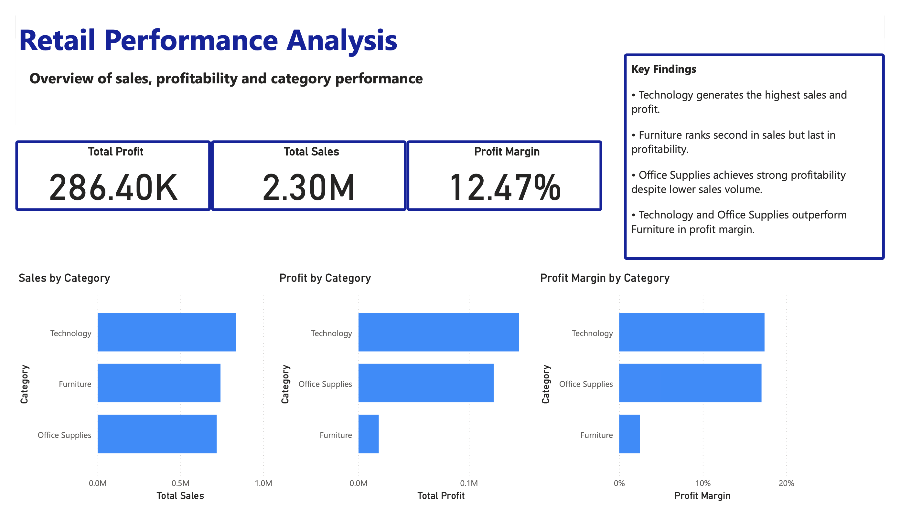
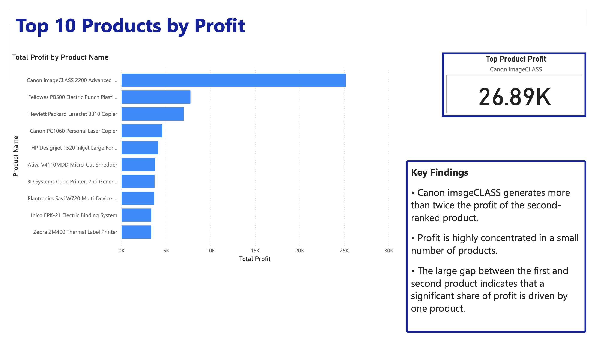
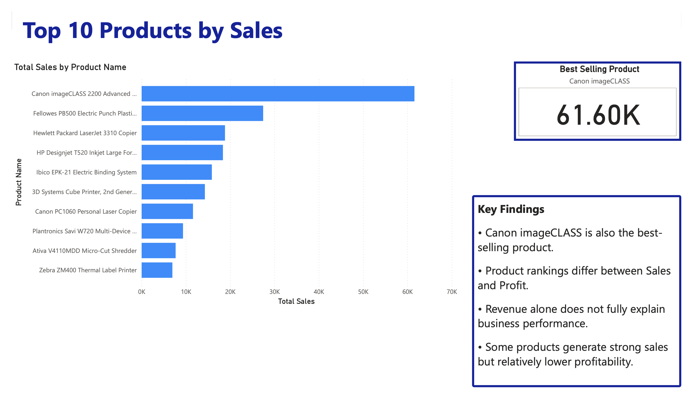

# FinTech Data Analytics Portfolio

## Overview

This repository contains a collection of data analytics and machine learning projects focused on real-world FinTech business problems.

The portfolio demonstrates practical experience with SQL, Python, Power BI, statistics, experimentation, and applied machine learning through customer analytics, fraud detection, lending, segmentation, and product analytics.

---

# Featured Projects

## SQL FinTech Customer Intelligence

Business-oriented SQL analysis covering customer behavior, transactions, merchants, and lending.

### Business Questions

#### Customer Analytics

- Who are the most valuable customers based on transaction volume?  
  → [View analysis](./sql-portfolio/fintech-customer-intelligence/q1_customers_by_transaction_volume.md)

- Which cities generate the highest customer value?  
  → [View analysis](./sql-portfolio/fintech-customer-intelligence/q2_customer_value_by_city.md)

#### Transaction Analytics

- How does transaction activity evolve over time?  
  → [View analysis](./sql-portfolio/fintech-customer-intelligence/q3_transaction_activity_over_time.md)

#### Merchant Analytics

- Which merchants receive the highest transaction volume?  
  → [View analysis](./sql-portfolio/fintech-customer-intelligence/q4_top_merchants_by_transaction_volume.md)

#### Lending Analytics

- Is there a relationship between credit score and loan size?  
  → [View analysis](./sql-portfolio/fintech-customer-intelligence/q5_credit_score_vs_loan_amount.md)

---

## Product Experiment Analysis (A/B Testing)

Business case evaluating a new FinTech feature using statistical experimentation.

The project analyzes:

- Customer engagement
- Transaction behavior
- Savings growth
- Customer retention

using a controlled A/B testing framework.

→ [Open in Google Colab](https://colab.research.google.com/drive/1B_zYgAl8iF-o7rTBStNHLHUbM5zU7AcI?usp=sharing)

---

## FinTech Analytics Pipeline (Python)

End-to-end analytics workflow built with Python, including:

- Data cleaning
- Exploratory Data Analysis
- Feature engineering
- KPI generation
- Business insights
- Financial reporting

→ [Open in Google Colab](https://colab.research.google.com/drive/1CYiFrPxlK0cD04ajcl4YOoGWy6lhcziZ?usp=sharing)

---

## BERT-Based FinTech Fraud Text Classifier

Transfer Learning NLP project using BERT to classify FinTech support and transaction messages as normal or fraud-related.

Features include:

- Transfer Learning
- BERT
- LIME Explainability
- t-SNE Visualization
- Interactive Gradio Interface

→ [Open in Google Colab](https://colab.research.google.com/drive/13kMGWIbXsbtk7NdYofNdwGHdtH5OrcD3?usp=sharing)

→ [Try the Live Demo](https://huggingface.co/spaces/Augustordiaz/bert-based-fintech-fraud-text-classifier)

---

## Power BI Dashboards

Interactive dashboards for business KPI monitoring, financial analysis, and product performance insights.

---

## Financial Dashboard for CFO

Executive-level financial performance analysis.

### Key Insights
- Revenue and profit performance across countries
- Sales trends over time
- Segment profitability breakdown

### Dashboard Pages

#### Page 1 – Financial Overview

### Files
- [Download PBIX](./power-bi/pbi-financial-dashboard-for-cfo/financial-dashboard-for-cfo-augusto-diaz.pbix)
- [View PDF](./power-bi/pbi-financial-dashboard-for-cfo/financial-dashboard-for-cfo.pdf)

---

## Loan Approval Analysis Dashboard

This dashboard analyzes loan application outcomes to understand approval patterns, risk factors, and borrower characteristics.

It focuses on identifying how financial and demographic variables influence loan approval decisions.

### Key Insights

- Loan approval rates across different customer segments
- Relationship between income levels and approved loan amounts
- Credit score distribution among approved and rejected applicants
- Impact of education and employment status on approval probability

### Page 1 – Approval Overview

### Page 2 – Income vs Loan Amount

### Files
- [Download PBIX](./power-bi/pbi-loan-approval-analysis/loan-approval-analysis-dashboard.pbix)
- [View PDF](./power-bi/pbi-loan-approval-analysis/loan-approval-analysis-dashboard.pdf)

---

## Superstore Sales & Profit Analysis Dashboard

This dashboard evaluates retail performance across products, categories, and customer segments, with a focus on identifying profit drivers and inefficiencies.

### Key Insights

- Technology category generates the highest profit margins
- Furniture category shows high sales but low profitability
- Profit concentration is driven by a small number of top-performing products
- Clear mismatch between sales volume and actual profit contribution

### Page 1 – Category Overview

### Page 2 – Top Products by Profit

### Page 3 – Top Products by Sales

### Files
- [Download PBIX](./power-bi/pbi-superstore-analysis/superstore-sales-and-profit.pbix)
- [View PDF](./power-bi/pbi-superstore-analysis/superstore-sales-and-profit.pdf)

---

# Additional Projects

## Credit Default Prediction

Machine learning project predicting customer credit default using multiple classification algorithms.

Features:

- Logistic Regression
- Random Forest
- KNN
- SHAP Explainability
- ROC AUC Evaluation

→ [Open in Google Colab](https://colab.research.google.com/drive/1wJXDef5nr5AKgjoDQSdjPvj1S3Cc38uX?usp=sharing)

→ [Try the Live Demo](https://huggingface.co/spaces/Augustordiaz/credit-card-default)

---

## Credit Card Customer Segmentation

Unsupervised learning project using PCA and K-Means clustering to identify customer segments and generate business recommendations.

→ [Google Colab Link](https://colab.research.google.com/drive/1PbjQkYfw-KbnUbDH0yazVpWphFCJNQYI?usp=sharing)

---

## Superstore Order Profitability Prediction

Machine learning project predicting order profitability using multiple classification models and explainability techniques.

→ [Google Colab Link](https://colab.research.google.com/drive/1VlXP5ohPBQ-eStSd3iH1LSk2xf0ZxzQL?usp=sharing)

---

# Technical Skills Demonstrated

## Data Analytics
- SQL (SELECT, JOINs, GROUP BY, filtering, aggregations)
- Data cleaning and preprocessing
- KPI definition and business metric analysis
- Exploratory Data Analysis (EDA)
- Data storytelling and reporting

## Python for Data Analysis
- Pandas, NumPy
- Data wrangling and transformation
- Feature engineering
- Data visualization (Matplotlib, Seaborn)
- Statistical analysis

## Machine Learning
- Supervised learning (classification, regression)
- Unsupervised learning (KMeans, PCA)
- Model evaluation (accuracy, precision, recall, ROC AUC)
- Explainability (SHAP, LIME)

## NLP & Deep Learning
- BERT fine-tuning using transfer learning
- Text classification for FinTech use cases
- Hugging Face Transformers
- Gradio interactive applications

## Business Intelligence
- Power BI dashboard development
- KPI design and executive reporting
- Multi-page dashboard storytelling

## Purpose

This portfolio showcases practical data analytics and machine learning solutions for real-world business problems, with a primary focus on FinTech analytics, customer behavior, experimentation, fraud detection, and financial decision support.
