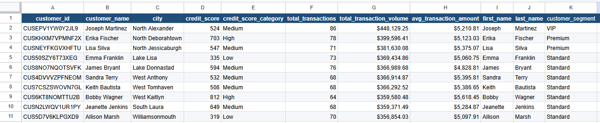
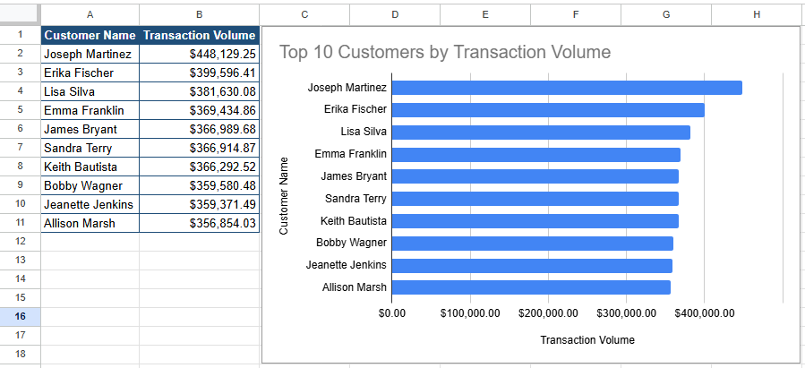

# Q1. Top Customers by Transaction Volume

## Business Question

Who are the highest-value customers by transaction volume?

## SQL Query

See: `sql/q1_top_customers.sql`

```sql
SELECT
    c.customer_id,
    c.first_name,
    c.last_name,
    c.city,
    c.credit_score,
    COUNT(t.transaction_id) AS total_transactions,
    ROUND(SUM(t.amount_usd), 2) AS total_transaction_volume,
    ROUND(AVG(t.amount_usd), 2) AS avg_transaction_amount
FROM transactions t
JOIN accounts a
    ON t.account_id = a.account_id
JOIN customers c
    ON a.customer_id = c.customer_id
GROUP BY
    c.customer_id,
    c.first_name,
    c.last_name,
    c.city,
    c.credit_score
ORDER BY total_transaction_volume DESC
LIMIT 10;
```

## Data Preparation



## Visualization



## Key Insight

Joseph Martinez generated the highest transaction volume ($448,129.25) across 86 transactions. The difference between the top-ranked customer and the rest of the Top 10 is relatively small, suggesting that transaction activity is distributed among several high-value customers rather than concentrated in a single account.