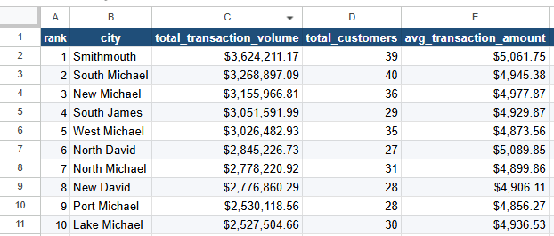
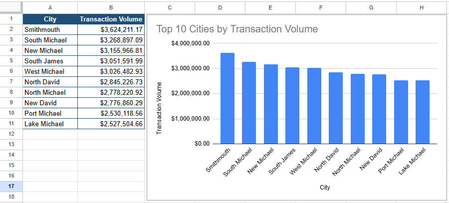

# Q2. Customer Value by City

## Business Question

Which cities generate the highest customer value?

## SQL Query

```sql
SELECT
    c.city,
    COUNT(DISTINCT c.customer_id) AS total_customers,
    ROUND(SUM(t.amount_usd), 2) AS total_transaction_volume,
    ROUND(AVG(t.amount_usd), 2) AS avg_transaction_amount
FROM customers c
JOIN accounts a
    ON c.customer_id = a.customer_id
JOIN transactions t
    ON a.account_id = t.account_id
GROUP BY c.city
ORDER BY total_transaction_volume DESC
LIMIT 10;
```

## Data Preparation



## Visualization



## Key Insight

Smithmouth generated the highest transaction volume ($3.62M), followed by South Michael ($3.27M) and New Michael ($3.16M). The relatively small gap between the top cities suggests that customer value is distributed across multiple locations rather than concentrated in a single market.