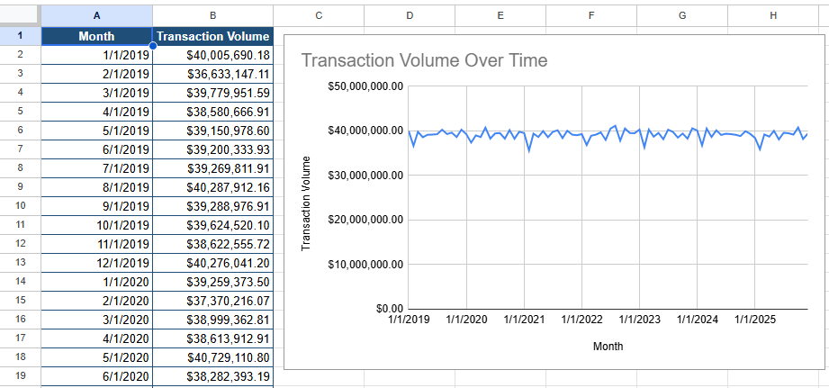

# Q3. Transaction Activity Over Time

## Business Question

How does transaction activity evolve over time?

## SQL Query

```sql
SELECT
    DATE_TRUNC('month', t.transaction_date) AS month,
    COUNT(t.transaction_id) AS total_transactions,
    ROUND(SUM(t.amount_usd), 2) AS total_transaction_volume,
    ROUND(AVG(t.amount_usd), 2) AS avg_transaction_amount
FROM transactions t
GROUP BY month
ORDER BY month;
```

## Data Preparation

The SQL output was exported to Google Sheets and formatted for visualization. The `Month` column was converted to a date format, and `total_transaction_volume` and `avg_transaction_amount` were formatted as currency. This prepares the data to create a clear trend over time.

## Visualization



## Key Insight

Monthly transaction volume is relatively stable over the period, fluctuating around $38–40 million per month. There are no major spikes or drops, suggesting consistent transaction activity throughout the observed period.