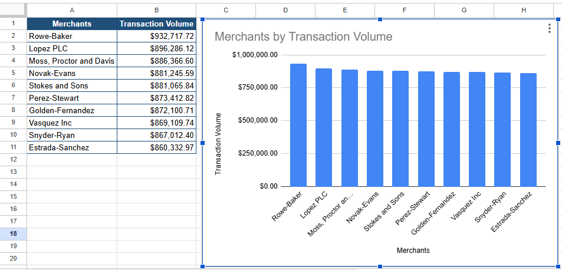

# Q4. Top Merchants by Transaction Volume

## Business Question

Which merchants receive the highest transaction volume?

## SQL Query

```sql
SELECT
    m.merchant_id,
    m.merchant_name,
    COUNT(t.transaction_id) AS total_transactions,
    ROUND(SUM(t.amount_usd), 2) AS total_transaction_volume,
    ROUND(AVG(t.amount_usd), 2) AS avg_transaction_amount
FROM merchants m
JOIN transactions t
    ON m.merchant_id = t.merchant_id
GROUP BY m.merchant_id, m.merchant_name
ORDER BY total_transaction_volume DESC
LIMIT 10;
```

## Data Preparation

The SQL output was exported to Google Sheets and formatted for visualization. The merchant names were left-aligned, and transaction volumes were formatted as currency. The merchants were sorted by total transaction volume to prepare for charting.

## Visualization



## Key Insight

Rowe-Baker generated the highest transaction volume ($932,717.72), followed closely by Lopez PLC ($896,286.12) and Moss, Proctor and Davis ($886,366.60). Transaction activity is relatively evenly distributed across the top 10 merchants, suggesting no single merchant dominates the bank’s transactions.