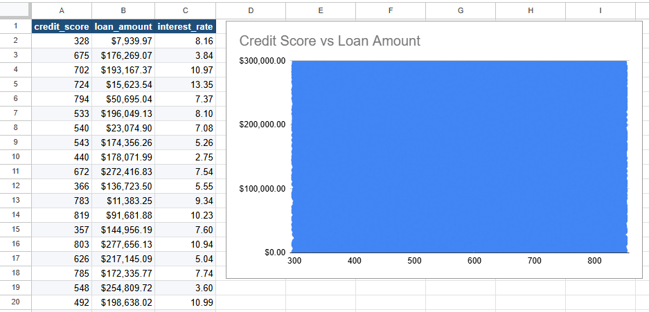
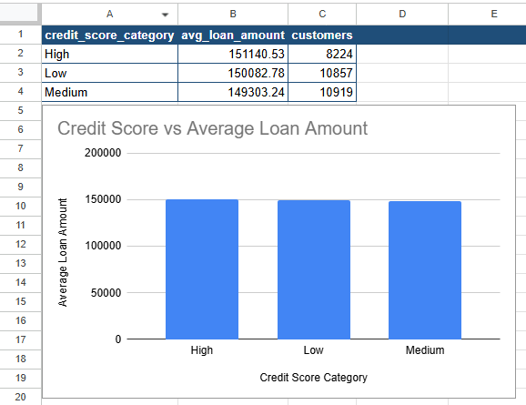

# Q5. Credit Score vs Loan Amount

## Business Question

Is there a relationship between credit score and loan size?

## SQL Query

### Initial Exploration

```sql
SELECT
    c.credit_score,
    l.loan_amount,
    l.interest_rate
FROM customers c
JOIN loans l
    ON c.customer_id = l.customer_id;
```

### Aggregated Analysis

```sql
SELECT
    CASE
        WHEN credit_score < 500 THEN 'Low'
        WHEN credit_score < 700 THEN 'Medium'
        ELSE 'High'
    END AS credit_score_category,
    ROUND(AVG(l.loan_amount), 2) AS avg_loan_amount,
    COUNT(*) AS customers
FROM customers c
JOIN loans l
    ON c.customer_id = l.customer_id
GROUP BY credit_score_category
ORDER BY avg_loan_amount DESC;
```

## Data Preparation

The initial dataset contained individual customer records with credit scores, loan amounts, and interest rates. An exploratory scatter plot was created to visualize the relationship between credit score and loan amount.

Because the large number of observations made the pattern difficult to interpret, credit scores were grouped into three categories:

- Low (< 500)
- Medium (500–699)
- High (700+)

The average loan amount was then calculated for each category to simplify the comparison.

## Visualization

### Exploratory Scatter Plot



### Aggregated Analysis



## Key Insight

Average loan amounts were very similar across all credit score categories:

- High: $151,140
- Low: $150,083
- Medium: $149,303

The differences between categories were minimal, suggesting that credit score alone is not a strong predictor of loan size in this dataset. Additional variables would likely be required to explain variations in loan amounts.